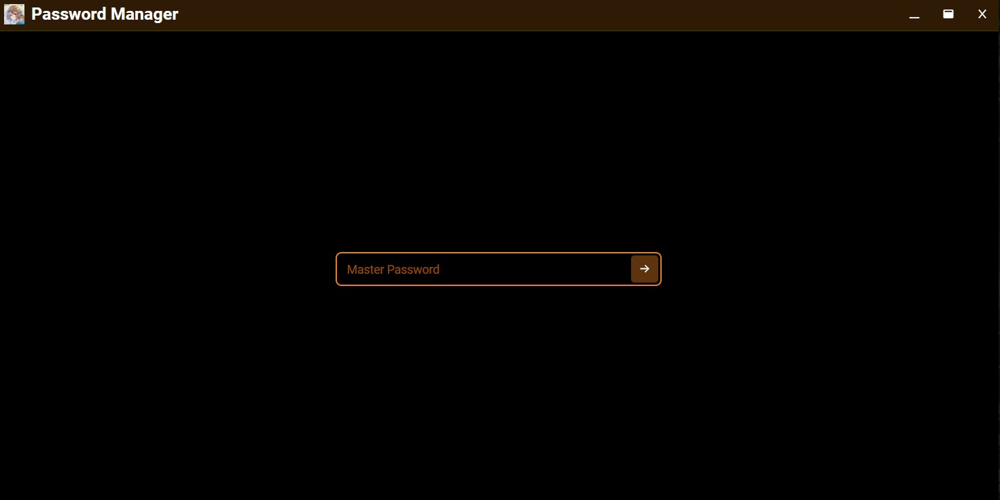
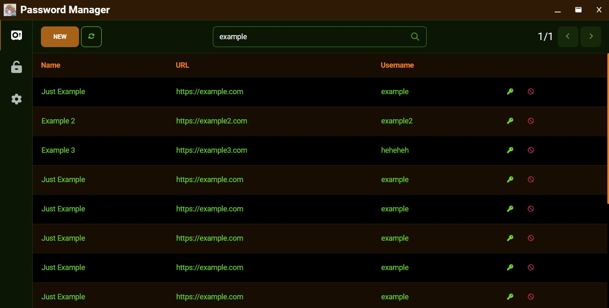
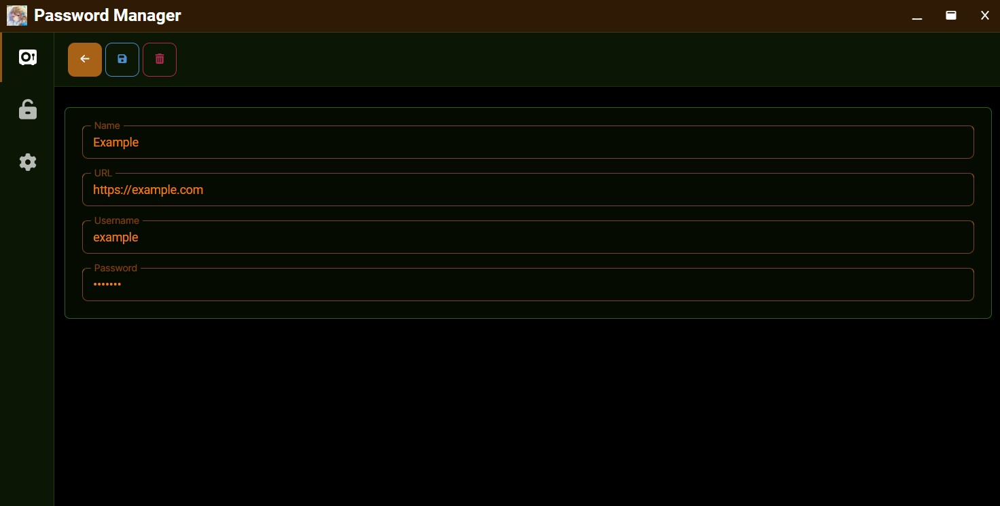

# VEdge

A **local-first, offline** password manager for the desktop. No server, no cloud — your vault is a
single encrypted file on your machine, unlocked with a master password (+ a device Secret Key). Built
with **Rust + Tauri v2** and a **Leptos** (Rust → WASM) frontend.

## Illustrations





## Security model

Every secret is encrypted **at the application level, per entry** — the SQLite database file itself is
plaintext and holds only ciphertext columns (there is no SQLCipher / full-DB encryption). Keys live
only in `mlock`ed, zeroize-on-drop memory during an unlocked session.

- **Key derivation:** a *two-secret* HKDF-SHA256 combine of the master password + a 16-byte device
  **Secret Key**, then **Argon2id** (256 MiB) → a master key, expanded by HKDF into a **KEK**, a
  verify-hash (constant-time checked before anything decrypts), and a reserved sync subkey.
- **Per-entry encryption:** a fresh **DEK per entry, per write**, wrapped with **AES-KW** (RFC 3394)
  under the KEK; payloads sealed with **XChaCha20-Poly1305**, AAD-bound to the entry's id + version.
- **At rest:** plain **bundled SQLite** via Sea-ORM (two databases — app settings + the encrypted
  vault). **A stolen vault file plus a guessed password is not enough** — the attacker also needs the
  Secret Key.

Full details, including the crate map and data flow, are in **[`ARCHITECTURE.md`](ARCHITECTURE.md)**.

## Workspace

A single Cargo workspace of Rust crates:

| Crate | Role |
|---|---|
| `vedge-core` | Domain model, use-cases, crypto, and SQLite storage (clean architecture). |
| `vedge-tauri` | The Tauri v2 desktop shell (the app binary) — a thin adapter over the core. |
| `vedge-ipc` | The serde wire types shared frontend ↔ shell. |
| `vedge-app` | The Leptos (CSR) frontend application. |
| `vedge-ui` | The Leptos design-system component library + theme engine. |
| `vedge-codegen` | Proc-macros. |
| `vedge-e2e` | WebDriver end-to-end test harness (opt-in). |

## Development

Tasks are run with [`mise`](https://mise.jdx.dev/).

```sh
mise setup     # one-time: wasm target, trunk, tauri-cli, leptosfmt, cargo-audit, cargo-deny
mise dev       # run the desktop app (Tauri + Trunk live-reload)
```

### Gates

```sh
mise ci        # fmt-check + clippy (-D warnings, whole workspace) + test + wasm check
mise audit     # supply-chain: cargo deny (RustSec advisories + bans + licenses + sources)
mise e2e       # opt-in WebDriver end-to-end (needs a display + a platform driver)
```

Individual gates: `mise fmt` · `mise lint` · `mise test` · `mise wasm`. The testing strategy (four
layers + the supply-chain gate) is documented in **[`docs/testing.md`](docs/testing.md)**; the
supply-chain policy lives in **[`deny.toml`](deny.toml)**.

## Status

Phase 1 (the vault) and Phase 2 (daily-use UX) are complete: create/unlock/lock a vault, nine entry
types with in-place edit, search + command palette, favorites/tags/folders, auto-lock + clipboard
auto-clear, entry history, theming, and biometric unlock (Windows Hello). Next up is **Phase 3 —
password generator**. See the roadmap in the design vault for the longer arc (documents, PKI,
steganography, LAN sync).

## License

Not yet licensed — the workspace crates are `publish = false` (private, not distributed on crates.io).
