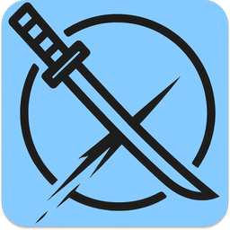

<p align="center">
  
</p>

<h1 align="center">VEdge</h1>

<p align="center">
  A <strong>local-first, offline</strong> password manager for the desktop.<br/>
  No server, no cloud — your vault is a single encrypted folder on your machine.
</p>

<p align="center">
  <a href="https://github.com/vyngt/vedge/releases/latest"></a>
  <a href="LICENSE"></a>
  
</p>

Unlocked with a master password **+ a device Secret Key** — so a stolen vault file and a guessed
password still aren't enough. Built with **Rust + Tauri v2** and a **Leptos** (Rust → WASM) frontend.

📖 **New here? Read the [User Guide](docs/guide/README.md)** — install, first vault, backups &
recovery, and the Emergency Kit / Recovery Key.

## Features

**Store more than passwords** — eight entry types, each with fields that fit: **Login** ·
**Card** · **Identity** · **SSH Key** · **API Key** · **Environment Variables** · **Secure Note** ·
**Document** (files encrypted at rest). Every save keeps the previous version, so you can restore an
entry's **history**; deletes go to a **trash** you can undo.

**Find it fast** — instant search, folders, tags, saved *smart folder* views, and a command palette.

**Passwords & 2FA** — a generator with three modes (**Random**, **Passphrase**, **PIN**, plus bulk),
built-in **TOTP** codes so you don't need a separate authenticator app, **password health** (weak,
reused, ageing), and an optional **breach check** against Have I Been Pwned using k-anonymity — only
a partial hash prefix ever leaves your machine, never the password. *Off by default.*

**Locking & privacy** — unlock with **Windows Hello**, auto-lock on idle / window blur / OS screen
lock, a hard maximum session length, and clipboard auto-clear on a timer you choose. The **audit
log** distinguishes *browsing* an entry from actually **copying or revealing** a secret, so you can
see what really left the vault.

**Backup & recovery** — **snapshots** (in-vault restore points for undoing a mistake), portable
**`.vbk` backups** (the whole vault, to keep elsewhere), **export/import** of entries, an optional
**Recovery Key** for a forgotten password, and **re-key** — a full re-encryption under brand-new
keys if you ever think your vault file was copied.

**Interface** — English + Vietnamese, light/dark and custom themes, keyboard-driven throughout.

## Screenshots

<p align="center">
  <br/>
  <br/>
  
</p>

More screens and a full walkthrough are in the **[User Guide](docs/guide/README.md)**.

## Download

**[⬇ Get VEdge 1.0.0](https://github.com/vyngt/vedge/releases/latest)** — Windows 10/11 (64-bit).
Pick the `-setup.exe` (NSIS) or the `.msi`.

Two things to know before you run it:

- **Verify the download.** The release page publishes a SHA-256 for each installer (and a
  `SHA256SUMS.txt`) — check yours with
  `Get-FileHash .\VEdge_1.0.0_x64-setup.exe -Algorithm SHA256` and compare.
- **Windows SmartScreen will warn you.** The build is unsigned (no code-signing certificate for
  1.0), so you'll get *"Windows protected your PC"* → **More info → Run anyway**. That warning is
  exactly why the checksum above matters — verify first, then click through.

Full walkthrough: **[Install & verify](docs/guide/README.md#install--verify)**.

## Before you trust it with your passwords

Local-first means **you hold the only keys** — nobody can reset them for you. Four facts worth
knowing up front:

- 🔑 **Save your Emergency Kit.** It carries your Secret Key, is shown **once**, and can't be
  regenerated. Master password **+** Emergency Kit is what gets you back in on a new machine.
- 🚪 **A forgotten password is unrecoverable by default.** The optional **Recovery Key** is the cure
  — but it's a *separate* document, and **neither one opens the vault alone**. Keep them apart.
- 📸 **A snapshot is not a backup.** Snapshots live *inside* the vault folder: they undo mistakes,
  they don't survive a lost disk. For that, make a `.vbk` and store it somewhere else.
- ⏳ **Re-key protects you going forward — it can't un-leak the past.** If someone already copied
  your vault *and* had your credentials, re-keying stops future opens of that copy; it can't retract
  what was already read.

The **[User Guide](docs/guide/README.md)** explains each of these properly.

## Security model

Every secret is encrypted **at the application level, per entry** — the SQLite database file itself is
plaintext and holds only ciphertext columns (there is no SQLCipher / full-DB encryption). Keys live
only in `mlock`ed, zeroize-on-drop memory during an unlocked session.

- **Key derivation:** a *two-secret* HKDF-SHA256 combine of the master password + a 16-byte device
  **Secret Key**, then **Argon2id** (256 MiB) → a master key, expanded by HKDF into a **KEK**, a
  verify-hash (constant-time checked before anything decrypts), and a reserved sync subkey.
- **Per-entry encryption:** a fresh **DEK per entry, per write**, wrapped with **AES-KW** (RFC 3394)
  under the KEK; payloads sealed with **XChaCha20-Poly1305**, AAD-bound to the entry's id + version.
- **At rest:** plain **bundled SQLite** via Sea-ORM (two databases — app settings + the encrypted
  vault). **A stolen vault file plus a guessed password is not enough** — the attacker also needs the
  Secret Key.

Full details, including the crate map and data flow, are in **[`ARCHITECTURE.md`](ARCHITECTURE.md)**.

## Workspace

A single Cargo workspace of Rust crates:

| Crate | Role |
|---|---|
| `vedge-core` | Domain model, use-cases, crypto, and SQLite storage (clean architecture). |
| `vedge-tauri` | The Tauri v2 desktop shell (the app binary) — a thin adapter over the core. |
| `vedge-ipc` | The serde wire types shared frontend ↔ shell. |
| `vedge-app` | The Leptos (CSR) frontend application. |
| `vedge-ui` | The Leptos design-system component library + theme engine. |
| `vedge-generator` | The password/passphrase/PIN generation engine. |
| `vedge-codegen` | Proc-macros. |
| `vedge-e2e` | WebDriver end-to-end test harness (opt-in). |

## Development

Tasks are run with [`mise`](https://mise.jdx.dev/).

```sh
mise setup     # one-time: wasm target, trunk, tauri-cli, leptosfmt, cargo-audit, cargo-deny
mise dev       # run the desktop app (Tauri + Trunk live-reload)
```

### Gates

```sh
mise ci        # fmt-check + clippy (-D warnings, whole workspace) + test + wasm check
mise audit     # supply-chain: cargo deny (RustSec advisories + bans + licenses + sources)
mise e2e       # opt-in WebDriver end-to-end (needs a display + a platform driver)
```

Individual gates: `mise fmt` · `mise lint` · `mise test` · `mise wasm`. The testing strategy (four
layers + the supply-chain gate) is documented in **[`docs/technical/testing.md`](docs/technical/testing.md)**; the
supply-chain policy lives in **[`deny.toml`](deny.toml)**.

## Status

🎉 **v1.0.0 is released** — see [Features](#features) for what's in it.

**Deliberately not in 1.0**, so the absences read as decisions rather than gaps:

- **No cloud sync.** Moving a vault between machines is a deliberate `.vbk` step.
- **No auto-update** — only a manual update *check*. A silent updater is a standing
  remote-code-execution channel into a process holding every user's vault keys; VEdge will tell you
  a new version exists, but it will never install code by itself.
- **Windows only**, and **no browser extension**.

## Reporting a security issue

🔴 **Please don't open a public issue for a security bug** — a public report on a password manager
publishes a working attack before a fix exists. Use
**[private vulnerability reporting](https://github.com/vyngt/vedge/security/advisories/new)** instead.

See **[`SECURITY.md`](SECURITY.md)** for what's in scope, what's deliberately out of scope, and what
to expect after you report.

## License

**MIT** — see [`LICENSE`](LICENSE). Third-party attribution ships in the app under
**Settings ▸ About** and in `THIRD-PARTY-NOTICES.txt` beside the installer.
