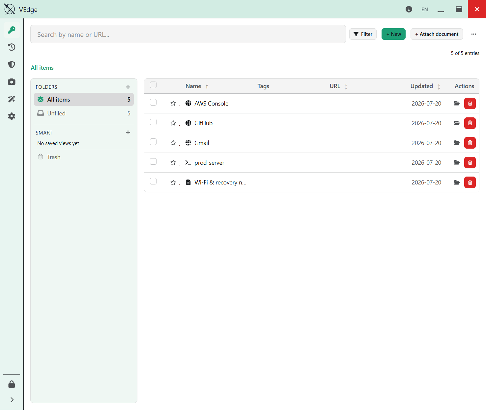
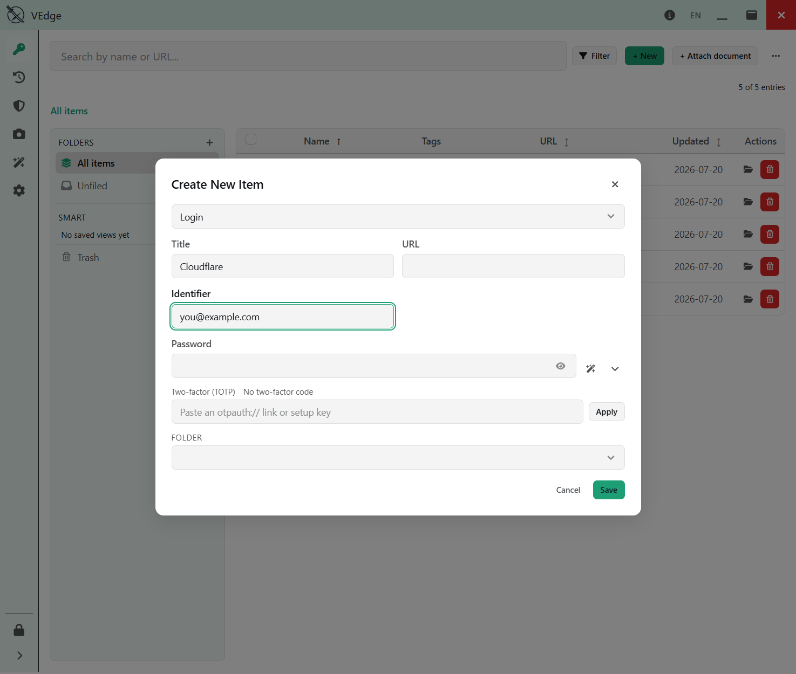
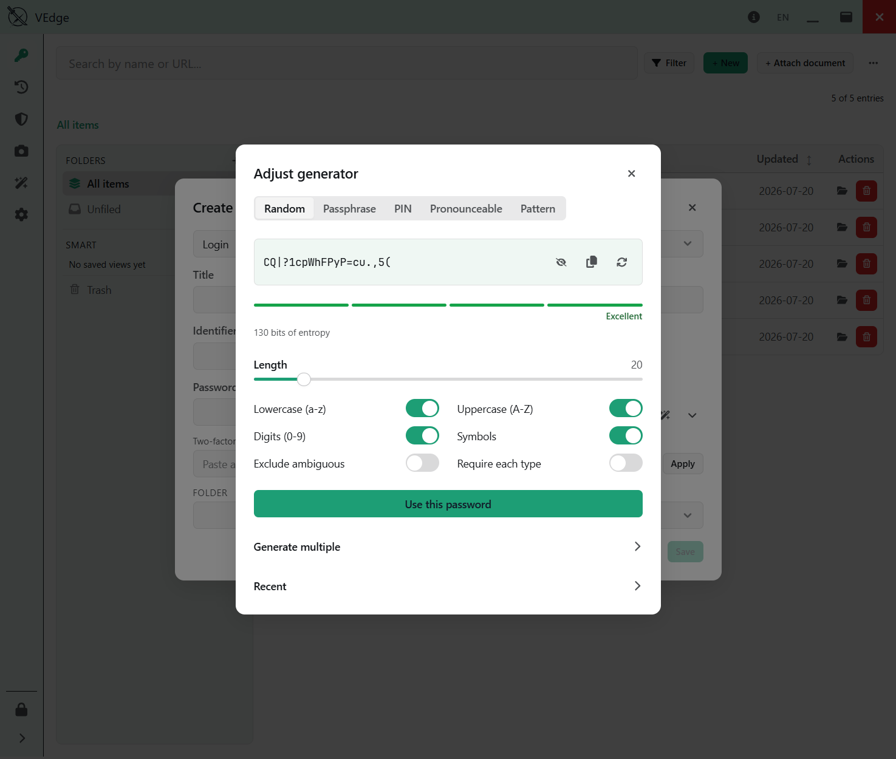

# VEdge

A **local-first, offline** password manager for the desktop. No server, no cloud — your vault is a
single encrypted folder on your machine, unlocked with a master password (+ a device Secret Key). Built
with **Rust + Tauri v2** and a **Leptos** (Rust → WASM) frontend.

[](https://github.com/vyngt/vedge/releases/latest)
[](LICENSE)


📖 **New here? Read the [User Guide](docs/guide/README.md)** — install, first vault, backups &
recovery, and the Emergency Kit / Recovery Key.

## Download

**[⬇ Get VEdge 1.0.0](https://github.com/vyngt/vedge/releases/latest)** — Windows 10/11 (64-bit).
Pick the `-setup.exe` (NSIS) or the `.msi`.

Two things to know before you run it:

- **Verify the download.** The release page lists a SHA-256 for each installer — check yours with
  `Get-FileHash .\VEdge_1.0.0_x64-setup.exe -Algorithm SHA256` and compare.
- **Windows SmartScreen will warn you.** The build is unsigned (no code-signing certificate for
  1.0), so you'll get *"Windows protected your PC"* → **More info → Run anyway**. That warning is
  exactly why the checksum above matters — verify first, then click through.

Full walkthrough: **[Install & verify](docs/guide/README.md#install--verify)**.

## Screenshots

<p align="center">
  <br/>
  <br/>
  
</p>

More screens and a full walkthrough are in the **[User Guide](docs/guide/README.md)**.

## Security model

Every secret is encrypted **at the application level, per entry** — the SQLite database file itself is
plaintext and holds only ciphertext columns (there is no SQLCipher / full-DB encryption). Keys live
only in `mlock`ed, zeroize-on-drop memory during an unlocked session.

- **Key derivation:** a *two-secret* HKDF-SHA256 combine of the master password + a 16-byte device
  **Secret Key**, then **Argon2id** (256 MiB) → a master key, expanded by HKDF into a **KEK**, a
  verify-hash (constant-time checked before anything decrypts), and a reserved sync subkey.
- **Per-entry encryption:** a fresh **DEK per entry, per write**, wrapped with **AES-KW** (RFC 3394)
  under the KEK; payloads sealed with **XChaCha20-Poly1305**, AAD-bound to the entry's id + version.
- **At rest:** plain **bundled SQLite** via Sea-ORM (two databases — app settings + the encrypted
  vault). **A stolen vault file plus a guessed password is not enough** — the attacker also needs the
  Secret Key.

Full details, including the crate map and data flow, are in **[`ARCHITECTURE.md`](ARCHITECTURE.md)**.

## Workspace

A single Cargo workspace of Rust crates:

| Crate | Role |
|---|---|
| `vedge-core` | Domain model, use-cases, crypto, and SQLite storage (clean architecture). |
| `vedge-tauri` | The Tauri v2 desktop shell (the app binary) — a thin adapter over the core. |
| `vedge-ipc` | The serde wire types shared frontend ↔ shell. |
| `vedge-app` | The Leptos (CSR) frontend application. |
| `vedge-ui` | The Leptos design-system component library + theme engine. |
| `vedge-generator` | The password/passphrase/PIN generation engine. |
| `vedge-codegen` | Proc-macros. |
| `vedge-e2e` | WebDriver end-to-end test harness (opt-in). |

## Development

Tasks are run with [`mise`](https://mise.jdx.dev/).

```sh
mise setup     # one-time: wasm target, trunk, tauri-cli, leptosfmt, cargo-audit, cargo-deny
mise dev       # run the desktop app (Tauri + Trunk live-reload)
```

### Gates

```sh
mise ci        # fmt-check + clippy (-D warnings, whole workspace) + test + wasm check
mise audit     # supply-chain: cargo deny (RustSec advisories + bans + licenses + sources)
mise e2e       # opt-in WebDriver end-to-end (needs a display + a platform driver)
```

Individual gates: `mise fmt` · `mise lint` · `mise test` · `mise wasm`. The testing strategy (four
layers + the supply-chain gate) is documented in **[`docs/technical/testing.md`](docs/technical/testing.md)**; the
supply-chain policy lives in **[`deny.toml`](deny.toml)**.

## Status

🎉 **v1.0.0 is released** (Windows) — [download it here](https://github.com/vyngt/vedge/releases/latest).

Shipped in 1.0: the vault and daily-use UX (eight entry types, folders/tags/search, entry history,
trash), the password generator, TOTP, password health + breach detection, the audit log, and the
data-safety work — snapshots, `.vbk` backups, entry export/import, the Recovery Key, and true re-key.
English + Vietnamese.

**Deliberately not in 1.0:** no cloud sync, no auto-update (a manual update *check* only — VEdge
never installs code by itself), no macOS/Linux build, no browser extension. See the roadmap in the
design vault for the longer arc (documents, PKI, LAN sync).

## License

**MIT** — see [`LICENSE`](LICENSE). Third-party attribution ships in the app under
**Settings ▸ About** and in `THIRD-PARTY-NOTICES.txt` beside the installer.
