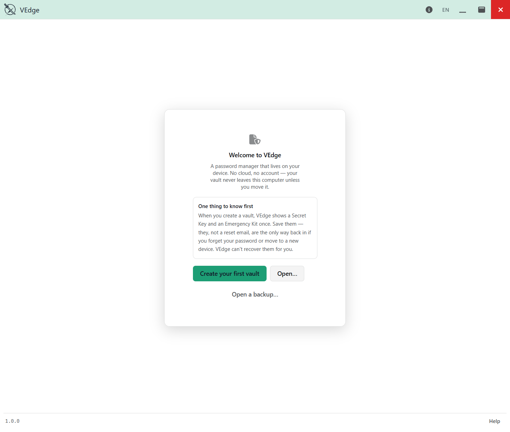

# VEdge — User Guide

VEdge is a **local-first password manager** for Windows. Your vault is a single
encrypted folder on *your* machine — there is no VEdge account, no cloud sync, and
no server that ever sees your data. That design is the whole point: nobody can hand
over, subpoena, or leak what they never hold. It also means **you** hold the only
keys, so this guide spends real time on backups and recovery — please read
[Keys & recovery](keys-and-credentials.md) before you rely on VEdge for anything
important.

- **Platform:** Windows 10/11 (64-bit). VEdge 1.0 is Windows-only.
- **Licence:** MIT (open source). Third-party notices ship inside the app under
  **Settings ▸ About** and in `THIRD-PARTY-NOTICES.txt` beside the installer.

---

## Contents

1. [Install & verify](#install--verify) — download, the SmartScreen warning, checksum verification
2. [Getting started](getting-started.md) — your first vault, entry types, the generator, TOTP, tags/folders/search
3. [Backups & recovery](backup-and-recovery.md) — snapshots vs backups vs export (three different things)
4. [Keys & credentials](keys-and-credentials.md) — the Emergency Kit, the Recovery Key, change-password vs re-key
5. [Health, breach checks & settings](health-and-settings.md) — the six settings tabs

---

## Install & verify

### 1. Download

Download the latest `VEdge_x.y.z_x64-setup.exe` (NSIS) or `VEdge_x.y.z_x64_en-US.msi`
(MSI) installer from the [Releases page](https://github.com/vyngt/vedge/releases/latest).
Each release also lists a **SHA-256 checksum** for every installer — you'll use it in
step 3.

### 2. The SmartScreen warning is expected

VEdge 1.0 is an **unsigned** open-source build (there is no paid code-signing
certificate). Because the binary isn't signed, **Windows SmartScreen will show a blue
"Windows protected your PC" warning** the first time you run the installer:

> Click **More info**, then **Run anyway**.

This is normal for unsigned software and is *not* a sign that anything is wrong — but
you should never take that on faith for a program that will hold all your passwords.
That is exactly what the checksum in the next step is for: it lets you prove the file
you downloaded is bit-for-bit the one that was published, before you run it.

> **Why unsigned?** Code-signing certificates cost money and require custody of a
> signing key. For a hobby, open-source 1.0 the project chose to ship unsigned and
> publish checksums instead. This is disclosed here rather than discovered by you at
> the warning dialog.

### 3. Verify the checksum (recommended)

Open **PowerShell**, then compute the hash of the file you downloaded and compare it
to the value on the release page:

```powershell
Get-FileHash .\VEdge_1.0.0_x64-setup.exe -Algorithm SHA256
```

Compare the printed `Hash` against the SHA-256 listed for that file on the GitHub
release. If they match, the download is intact and unmodified. **If they do not match,
delete the file and download it again** — do not run it.

For a hands-free compare:

```powershell
(Get-FileHash .\VEdge_1.0.0_x64-setup.exe -Algorithm SHA256).Hash -eq 'PASTE_PUBLISHED_HASH_HERE'
```

A result of `True` means it matches.

### 4. Run the installer

Run the installer and follow the prompts. On first launch VEdge may install the
Microsoft **WebView2** runtime if your system doesn't already have it (it ships with
current Windows). When VEdge opens with no vaults yet, you'll see the welcome screen —
head to [Getting started](getting-started.md).



---

*Screenshots in this guide are captured from the Windows build with the
`mise screenshots` task and refreshed whenever the UI changes — see
[`screenshots.md`](screenshots.md).*
