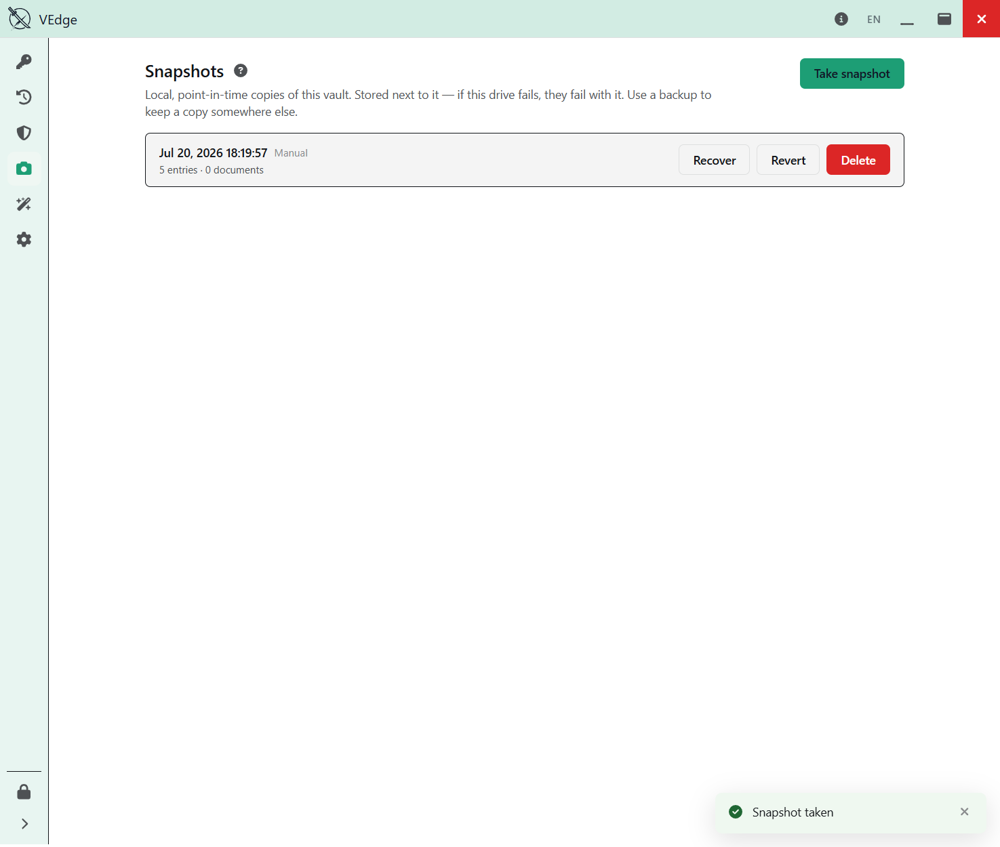

# Backups & recovery

← [Back to the guide](README.md)

VEdge gives you **three** different ways to protect and move your data, and they are not
interchangeable. Mixing them up is how people lose data, so it's worth ten minutes to
learn which is which:

| Feature | Question it answers | Where it lives |
| --- | --- | --- |
| **Snapshot** | "Take me **back in time** on this machine." | *Inside* your vault folder |
| **Backup** (`.vbk`) | "Give me the **whole vault** to keep **somewhere else**." | Wherever you put the file |
| **Export** | "Give me **these entries** to move into another app." | A file you choose |

Think of them as **TIME**, **SPACE**, and **ROWS**.

---

## Snapshots — going back in time

A **snapshot** is a point-in-time copy of your vault that VEdge keeps *inside the vault
folder*. Take one before a big change; if the change goes wrong, **revert** to the
snapshot and you're back where you were.

> ### A snapshot is **not** a backup
>
> This is the single most important thing on this page. A snapshot lives in the **same
> folder** as your vault. If that folder is lost — a failed disk, an accidental delete, a
> stolen laptop — **your snapshots are lost with it.** Snapshots protect you from
> *mistakes*; they do nothing to protect you from *losing the disk*. For that you need a
> backup (below), kept somewhere else.

Reverting to a snapshot locks the vault afterwards, and you unlock it fresh — VEdge does
this so it can prove the reverted vault really opens.

---

## Backups — a whole vault, somewhere else

A **backup** is your entire vault packed into a single portable `.vbk` file that you keep
**away** from the original — another drive, a USB stick, cloud file storage. This is what
survives a dead disk.

Use **Settings ▸ Backup ▸ Back up to…** to write a `.vbk`. This is a safe, read-only
operation: it copies your vault out; it never touches the original.

> The `.vbk` is not a time machine. It is **a vault in a suitcase** — the whole thing,
> ready to carry to another machine.

### You don't *restore* a backup — you **open** it

To use a `.vbk`, you **Open backup**: VEdge materializes the vault from the archive at a
location you choose. Two rules make this safe:

- **Open backup only ever creates a vault at an *empty* place.** If something is already
  there, it refuses — no flag, no confirmation, no override. It will never overwrite an
  existing vault.
- If you genuinely need to overwrite one vault with a backup, there's a deliberately
  buried **Advanced ▸ Replace** action that runs every guard and **takes a snapshot of
  the current vault first**, so even the dangerous path leaves you an undo.

The naming is the safety feature: "back up" and "open" are two clearly different verbs,
so you can't accidentally do the destructive thing while meaning to do the safe one.

> A snapshot must not be able to quiet the "you have no backup" reminder — so the app
> tracks when you last made a **real backup** separately, and taking a snapshot does not
> count. If VEdge nudges you to back up, take it seriously: make a `.vbk` and store it
> off the machine.

---

## Export & import — moving entries

**Export** is different again: it takes **entries** (some or all) out of the vault so you
can bring them into *another* app — or another VEdge. Reach it from the vault's **⋯**
menu (**Export…** for a selection or **Export all…**).

Two formats:

- **Encrypted archive** — a passphrase-protected file, ideal for moving entries into
  another VEdge vault. The passphrase you choose is the only key to it.
- **CSV (logins only)** — a plain-text spreadsheet, for importing into a different
  password manager. Because it's plain text, **anyone who gets the file can read it** —
  delete it as soon as you've imported it elsewhere.

**Import** brings entries in from a file (or a snapshot). VEdge shows a preview first.
Importing is **never a merge**: if you already have a folder named "Work", an imported
"Work" becomes a second folder beside it, so nothing is silently combined.

> VEdge never pretends a plain-text export file can be "securely wiped" from disk — once
> plaintext is written, it's out of the vault's control. If you're moving entries *within*
> VEdge, prefer the encrypted archive, or the snapshot-import path, so nothing plaintext
> ever hits the disk.

---

## Which one do I want?

- **"I'm about to make a risky change."** → Take a **snapshot** first.
- **"I want to survive a dead disk / have an off-machine copy."** → Make a **backup**
  (`.vbk`) and store it elsewhere. Do this regularly.
- **"I'm switching apps / sending some entries to another VEdge."** → **Export**.

None of these substitutes for the others. In particular: *snapshots are not backups.*

---

Next: [Keys & credentials](keys-and-credentials.md) — the Emergency Kit, the Recovery
Key, and the crucial difference between **changing your password** and **re-keying** a
vault you think was copied.
