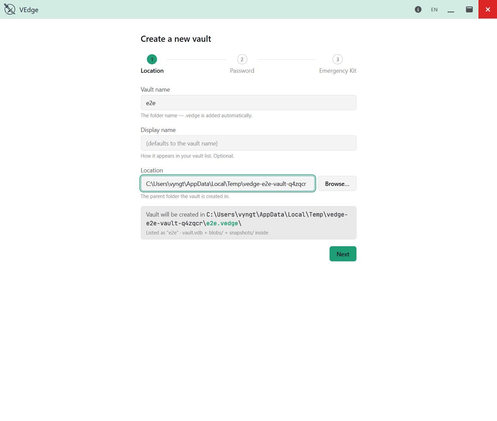
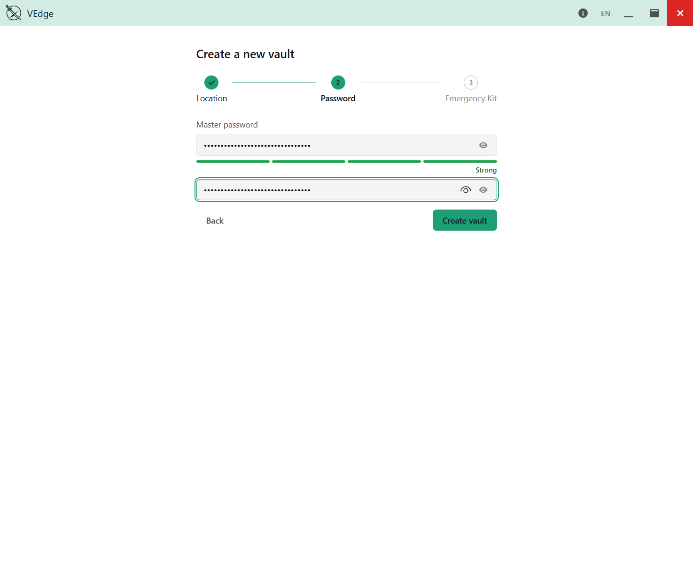
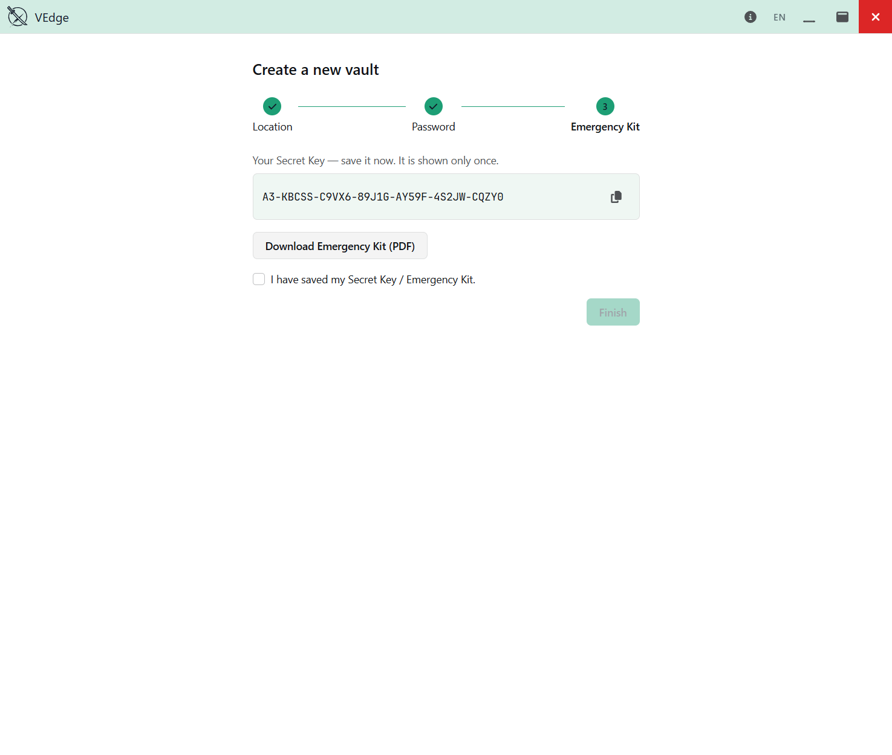
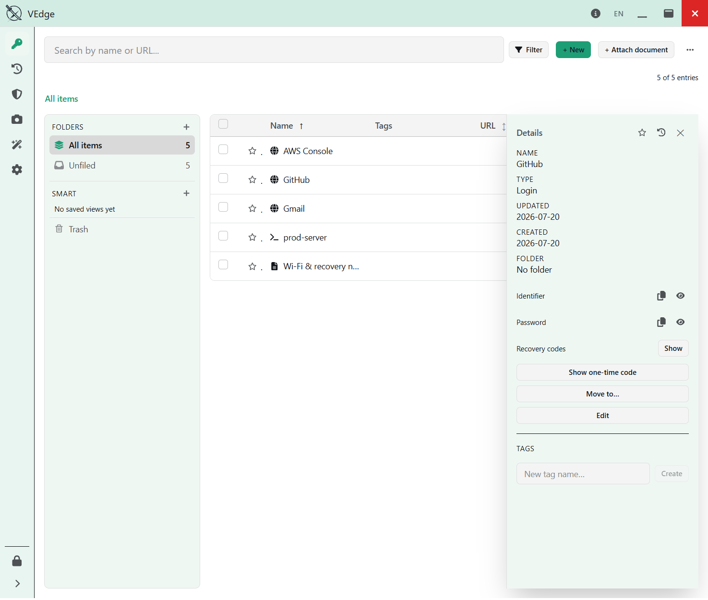
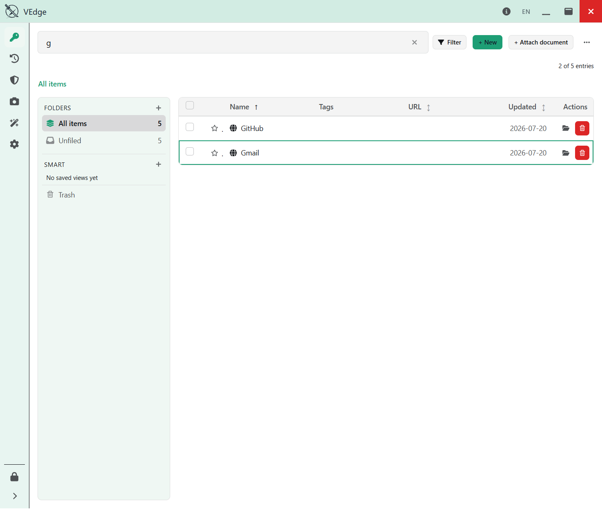

# Getting started

← [Back to the guide](README.md)

## Your first vault

From the welcome screen, click **New vault**.

**Step 1 — name and location.** Give the vault a name and choose where it lives. VEdge
stores each vault as its own `<name>.vedge` folder on your disk. You can keep it in your
Documents, on a synced drive, wherever you like — VEdge never moves it or copies it
anywhere on its own.

**Step 2 — master password.** Choose a strong master password. VEdge shows a strength
meter and won't let you continue with a weak one. This password never leaves your
machine and is never stored — if you forget it, only your Recovery Key (set up later)
or your Emergency Kit can get you back in.

**Step 3 — your Secret Key and Emergency Kit.** VEdge generates a random **Secret Key**
(a string beginning `A3-…`) and offers to save your **Emergency Kit** — a printable PDF
that contains that Secret Key.

> **Read this once, carefully.** Unlocking your vault needs **two** things: your master
> password (which you remember) *and* your Secret Key (which is on your Emergency Kit).
> The Secret Key is generated on your machine and shown **once**. VEdge cannot recover
> it for you. **Save the Emergency Kit now** — print it, or store the PDF somewhere safe
> and offline — before you tick "I saved my Secret Key" and finish.

Tick the acknowledgement and click **Finish**. Your vault opens, unlocked.

There's much more on why the Secret Key and Emergency Kit matter — and on the separate
Recovery Key — in [Keys & credentials](keys-and-credentials.md). It's the most important
section in this guide.

---

## Adding entries

Click **+ New** to add an entry. VEdge supports several entry types, each with fields
suited to what it holds:

- **Login** — website/username/password, plus an optional TOTP two-factor code.
- **Card** — card number, cardholder, expiry, CVV, PIN.
- **Identity** — name, address, and other personal details.
- **SSH Key** — a private key (multi-line), public key, fingerprint, key type, optional
  passphrase.
- **API Key** — key and secret.
- **Environment Variables** — a set of `KEY=value` pairs (handy for `.env` files).
- **Secure Note** — free-form encrypted text. A good home for anything without a
  dedicated field — **2FA backup / recovery codes**, licence keys, or security-question
  answers.
- **Document** — an attached file, encrypted at rest.

Pick the type from the selector at the top of the new-entry form, fill the fields, and
**Save**.

### Viewing and copying secrets

Click any entry to open its detail drawer. Passwords and other secrets stay **hidden**
by default. Use the per-field **Copy** button to put a value on the clipboard (VEdge
clears the clipboard automatically after a delay you set in Settings), or **Reveal** to
show it on screen.

> **Under the hood:** a stored secret only ever leaves the encrypted core when you
> explicitly copy or reveal it, and every such access is written to the audit log. Merely
> browsing an entry does not move the secret. This is deliberate — see
> [Health, breach checks & settings](health-and-settings.md#audit-log).

### Editing keeps history

Every time you save a change, VEdge keeps the previous version. You can view an entry's
history and restore an earlier version — useful when a rotated password turns out to be
wrong.

---

## Generating passwords

VEdge has a built-in generator. Open it from the sidebar, or inline while creating a
Login by clicking the small tune control next to the password field.

You can generate a **random password** — adjust the length and which character classes
to include — or a **memorable passphrase** of dictionary words. The generator also
supports generating several at once. Generated values use a monospaced font so
easily-confused characters (`l`/`1`/`I`, `0`/`O`) stay distinguishable when you read
them.

---

## Two-factor codes (TOTP)

For a Login, you can store a **TOTP** two-factor secret (the same "authenticator app"
seed a site gives you when you enable 2FA). VEdge then shows the current rotating
six-digit code right on the entry, so you don't need a separate authenticator app. Copy
the code with one click when a site asks for it.

Your TOTP *seed* is treated like any other secret: it's encrypted at rest and only
revealed on explicit request.

---

## Organizing: folders, tags, and search

As your vault grows:

- **Folders** group entries hierarchically — create a folder and move entries into it.
- **Tags** label entries across folders (for example, `work` or `finance`).
- **Search** filters the list as you type.
- The **filter** popover narrows by entry type and by tags (match any/all), and you can
  sort by clicking a column header. Save a filter as a **smart folder** to return to it
  quickly.

---

Next: [Backups & recovery](backup-and-recovery.md) — the three different ways VEdge
protects your data, and why they are *not* interchangeable.
