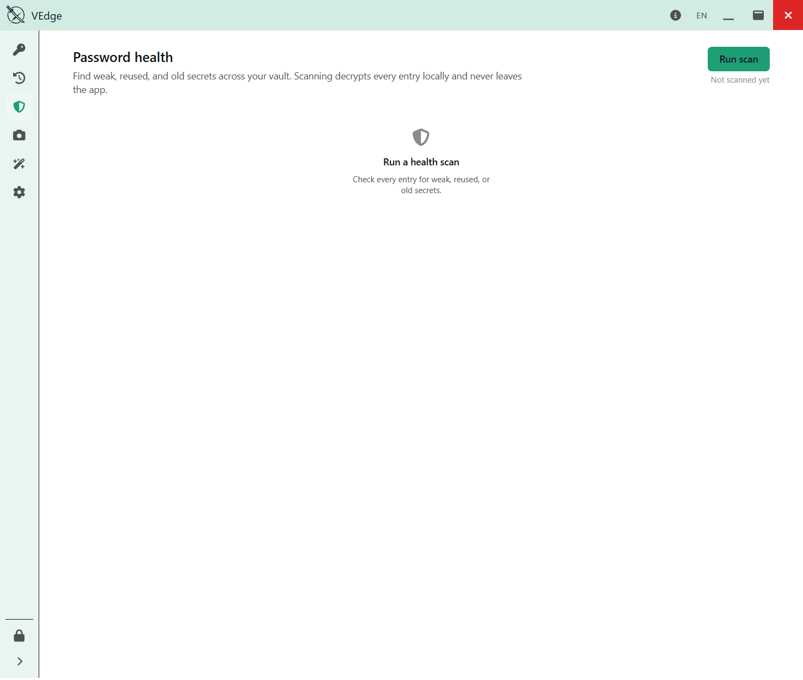
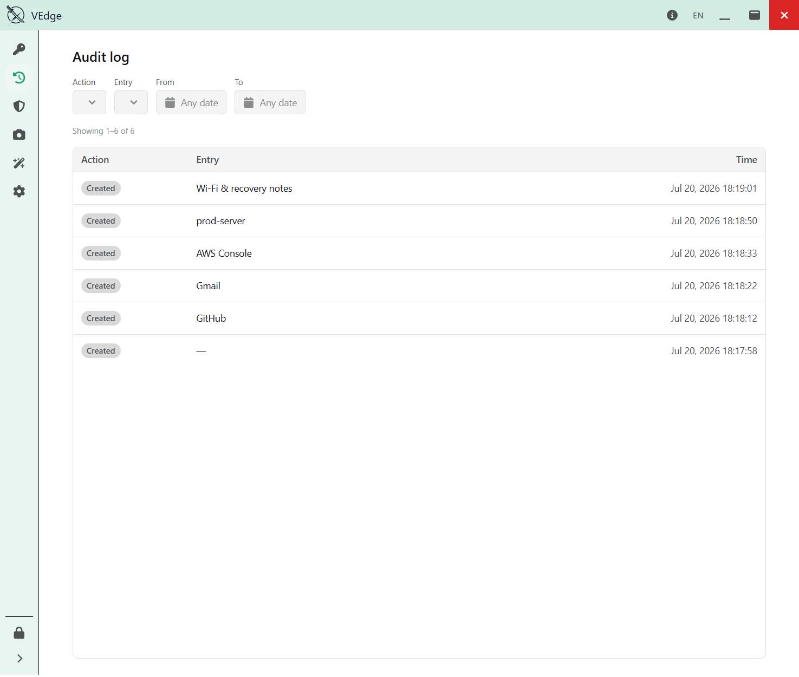
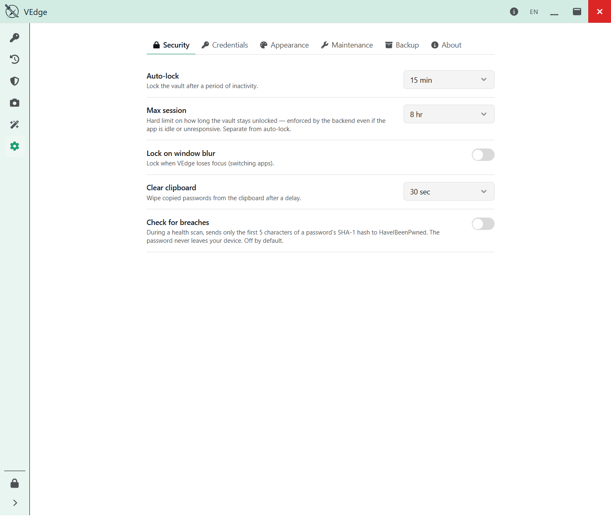
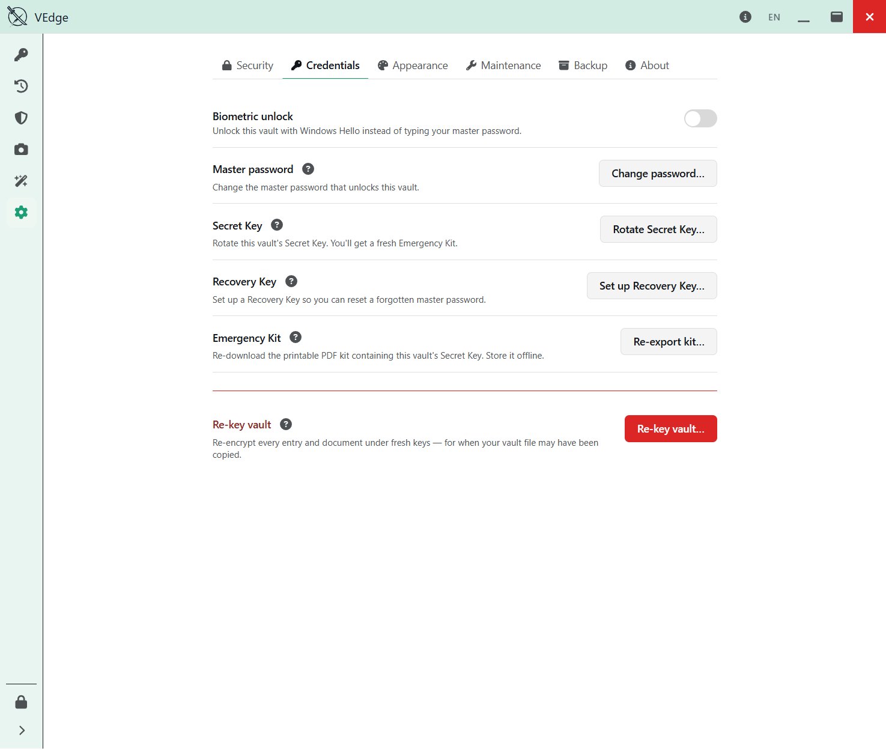
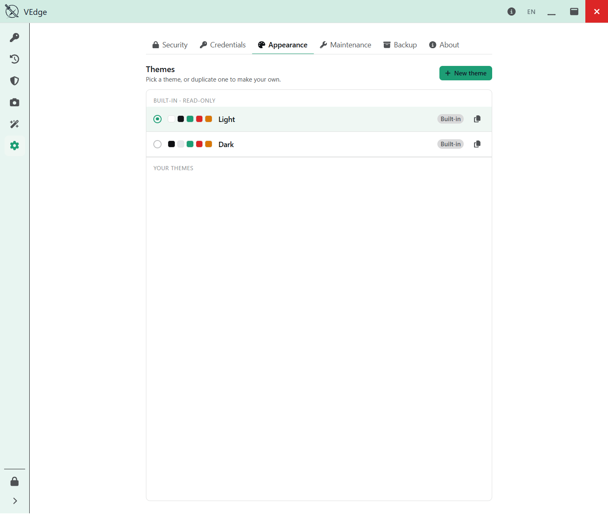
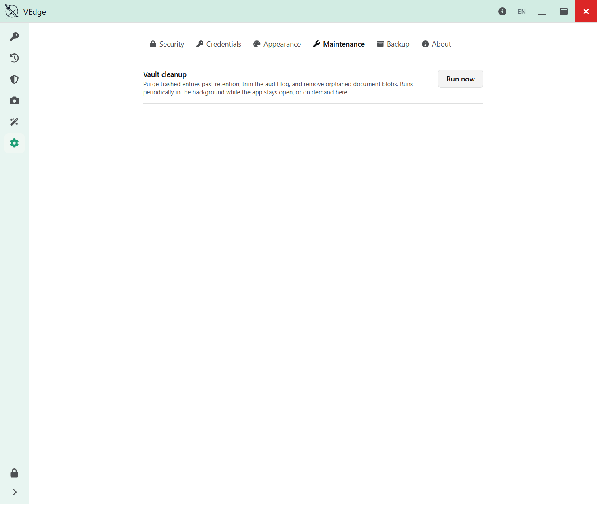
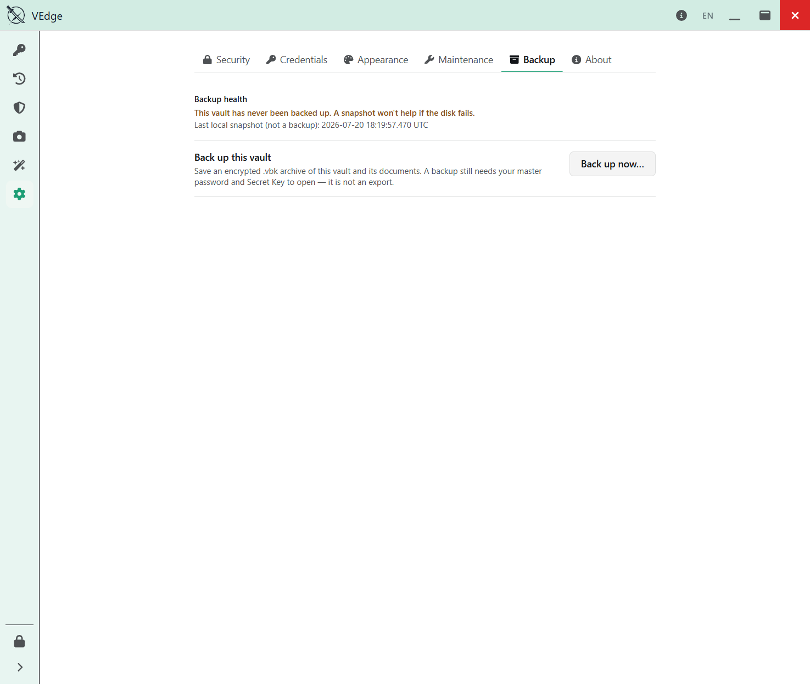
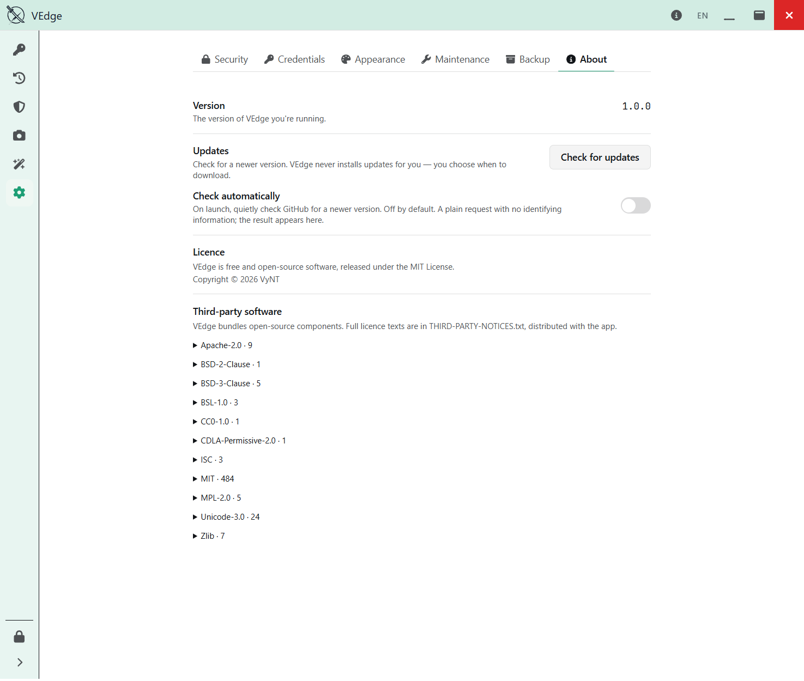

# Health, breach checks & settings

← [Back to the guide](README.md)

## Password health

The **Health** page reviews your logins and flags problems you can act on: **weak**
passwords, passwords **reused** across entries, and credentials that are getting **old**.
Work down the list and fix what matters.

### Breach detection

VEdge can also check whether a password has appeared in a known data breach, using the
"Have I Been Pwned" dataset. It does this with **k-anonymity**: only the first five
characters of a hash of your password ever leave your machine, and the full password
never does. Breach checking is **off by default** and enabled under **Settings ▸
Security** — it's the one feature that makes a network request, so it's opt-in and
disclosed.

---

## Audit log

The **Audit** page is a local record of what happened in your vault: entries created and
edited, secrets **copied** or **revealed**, credential operations, backups, and more.

Note the distinction between *browsing* and *extraction*: opening an entry to look at it
is recorded as a view, while actually **copying or revealing** a secret is recorded as a
separate, stronger event — so the log tells you not just what you looked at, but what
actually left the vault.

---

## Settings

Settings has six tabs.

### Security

Behavioural preferences (all saved instantly):

- **Auto-lock** — lock the vault after a period of inactivity.
- **Maximum session** — a hard cap on how long a session stays unlocked.
- **Lock on window blur** — lock when VEdge loses focus.
- **Clear clipboard** — how long a copied secret stays on the clipboard before VEdge wipes
  it.
- **Breach detection** — the opt-in check described above.

### Credentials

The credential *operations*, kept separate from the everyday preferences above so a
destructive action never sits next to a dropdown:

- **Biometric unlock** — unlock with Windows Hello (after enrolling with your password).
- **Change master password**, **Rotate Secret Key**, **Recovery Key**, **Emergency Kit**,
  and the **Re-key** danger zone.

All of these are covered in detail in [Keys & credentials](keys-and-credentials.md).

### Appearance

Themes. Pick a built-in theme or create your own.

### Maintenance

Housekeeping — prune old data according to your retention preferences.

### Backup

**Back up to…** and **Open backup** — covered in
[Backups & recovery](backup-and-recovery.md).

### About

Your VEdge **version**, a manual **Check for updates** action, the **MIT** licence, and
the **third-party notices** for the open-source libraries VEdge is built on.

> **Updates are manual and private.** VEdge does not auto-install anything. "Check for
> updates" makes a plain, unauthenticated request to the public GitHub releases page and
> compares versions — no account, no identifier, no telemetry. An optional auto-check is
> **off by default**; turn it on if you'd like a quiet nudge when a new version ships.
> When an update is available, VEdge points you to the download — you install it yourself,
> and you can [verify its checksum](README.md#3-verify-the-checksum-recommended) just like
> the first time.

---

← [Back to the guide](README.md)
