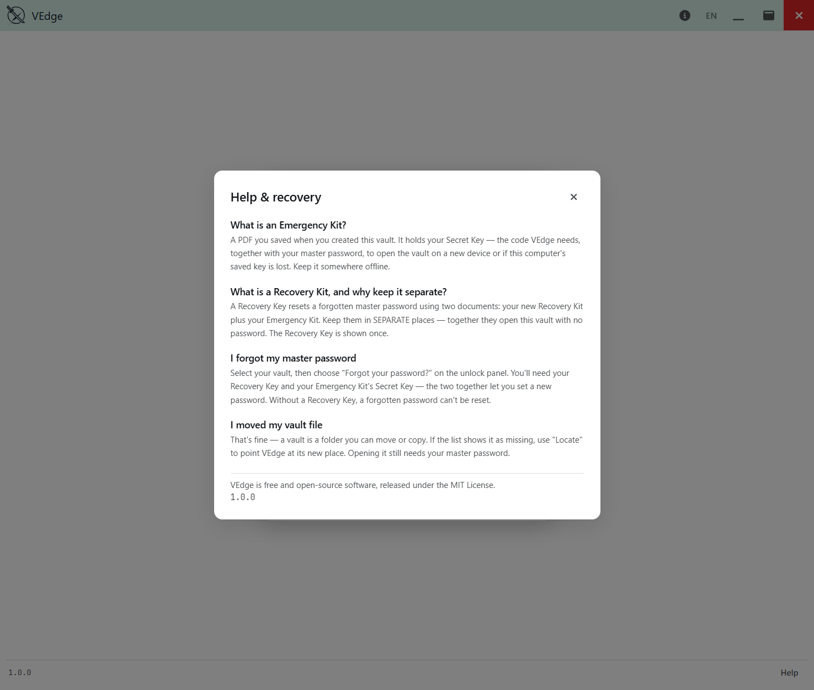
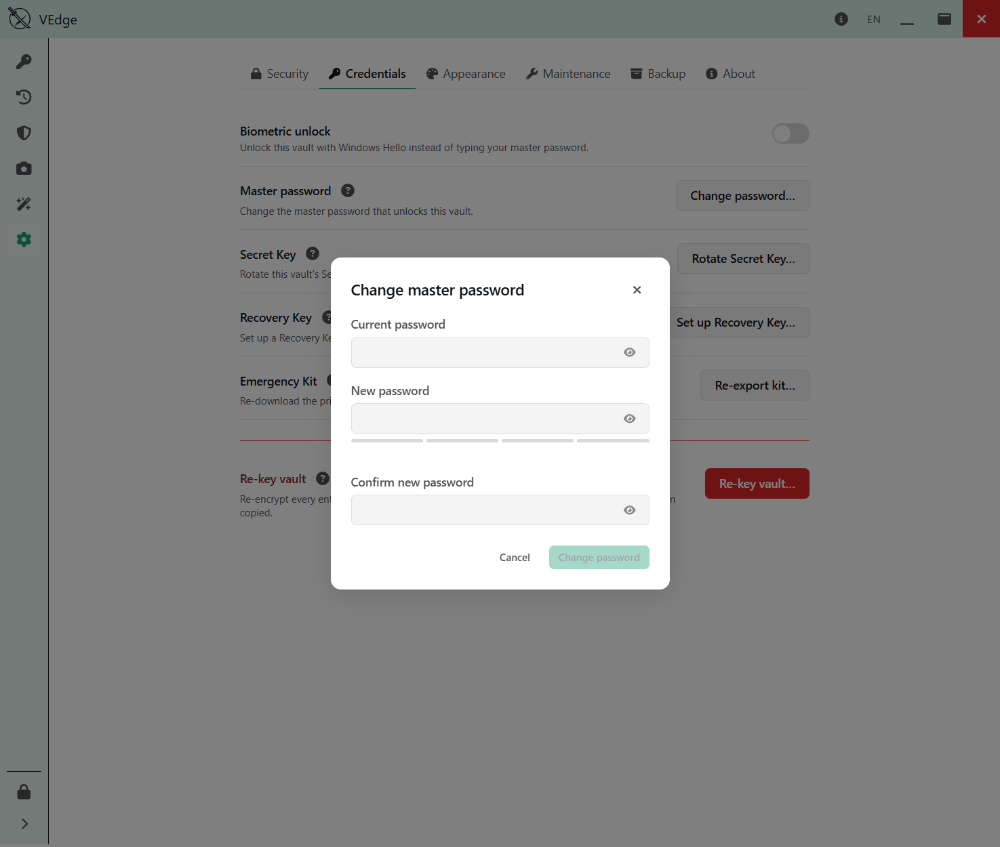
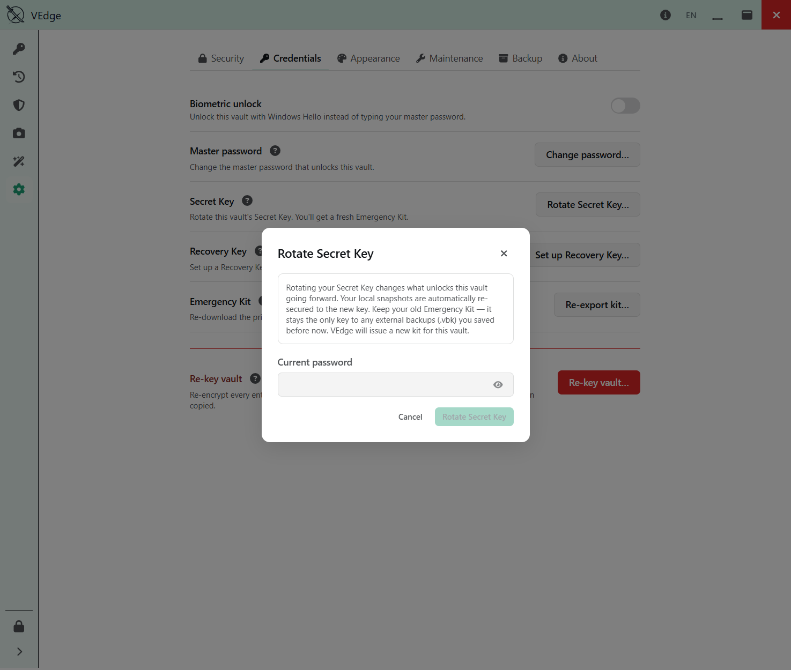
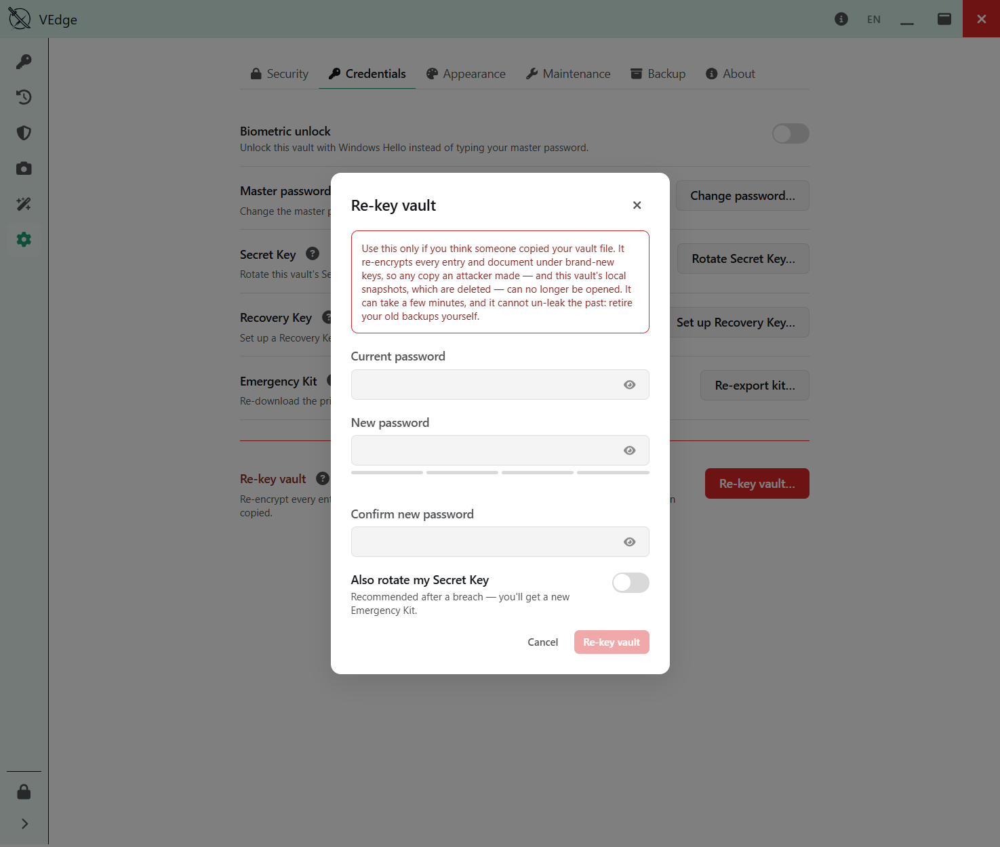

# Keys & credentials

← [Back to the guide](README.md)

This is the most important section in the guide. VEdge holds no copy of your keys, so
what you do here decides whether you can *always* get back into your vault — and whether
someone who steals your vault file can. Please read it before you rely on VEdge.

---

## What unlocks your vault

Two things, together:

1. **Your master password** — you remember it. It's never stored anywhere.
2. **Your Secret Key** (`A3-…`) — it's on your **Emergency Kit**. It's random, generated
   on your machine, and shown only once.

You need **both** to unlock. This is deliberate: your password alone is not enough to
open the vault, so a leaked or guessed password doesn't hand someone your data unless
they also have your Secret Key.

### The Emergency Kit

The **Emergency Kit** is the printable PDF from vault creation. It carries your Secret
Key. You'll need it to unlock the vault after a reinstall, on a new machine, or any time
the Secret Key isn't already remembered by this device.

- **Save it when VEdge offers it, and keep it safe and offline** — printed and filed, or
  the PDF on an encrypted drive.
- You can re-download it any time from **Settings ▸ Credentials ▸ Emergency Kit**.

### The Recovery Key — a *separate* safety net

By default, a forgotten master password is **unrecoverable** (that's what makes VEdge
safe). The **Recovery Key** (`RK1-…`) is the opt-in cure. Set one up under **Settings ▸
Credentials ▸ Recovery Key**, and VEdge produces a **Recovery Kit** — a *different*
document from your Emergency Kit.

> **Neither document opens the vault by itself.** The Recovery Key is bound to your Secret
> Key: to reset a forgotten password you need the **Recovery Kit** *and* your **Emergency
> Kit** (the Secret Key). Keep the two documents **apart** — separate places — so no
> single lost or stolen item is enough to get in.
>
> 🔴 **Losing both is unsurvivable.** If you lose your master password *and* your Recovery
> Kit *and* your Emergency Kit, no one — not you, not the VEdge developers — can open the
> vault. Store them like they matter, because they do.

### I forgot my password

On the launch screen, choose **Forgot password?**. Provide your Recovery Kit and your
Emergency Kit (Secret Key); VEdge verifies both and walks you through setting a new
password. (Resetting this way turns the old Recovery Key off — set up a fresh one
afterward if you want the safety net back.)

The launch screen also has a **Help** button that answers these recovery questions
without needing to unlock first — exactly where a locked-out user needs them.

---

## Changing your credentials — three operations, by intent

VEdge deliberately gives you **three separate** credential operations, named for *why*
you'd reach for them, because they do very different things. All three live under
**Settings ▸ Credentials**.

### Change master password

You just want a different password. Enter the current one, choose a new one, done. Your
Secret Key and Emergency Kit are unchanged.

### Rotate Secret Key

You want to replace the Secret Key itself — VEdge generates a new one and issues a **new
Emergency Kit**.

> **Keep your old Emergency Kit.** Rotating changes what unlocks this vault going forward.
> Your **local snapshots are automatically re-secured to the new key** — you don't have to
> do anything for them. But any **external `.vbk` backups** you made before the rotation
> are *not* touched, so your **old Emergency Kit stays the only key to those older
> backups.** Don't shred it; file it with them.

### Re-key — for a vault you think was **copied**

This is the serious one. Use it only if you believe **someone got a copy of your vault
file** (a stolen laptop, a synced folder you no longer trust). Changing your password
does **not** help here: an attacker with a copy of the file plus your old credentials
could still open every entry. Re-key fixes that — and only re-key does.

Re-key **re-encrypts every entry and document under brand-new keys.** After it finishes:

- Any copy an attacker already made can **no longer be opened** with the old credentials.
- **This vault's local snapshots are deleted** — a snapshot is a copy of what the attacker
  may have seen, so re-key retires them.
- **Your older `.vbk` backups become unreadable** too (they were encrypted under the old
  keys). Make a fresh backup afterward, and retire the old ones yourself.

Re-key can take a few minutes on a large vault, and shows a progress bar so it never looks
stuck.

> 🔴 **Re-key protects the vault going *forward*. It cannot un-leak the past.** If an
> attacker already copied your file *and* already had your credentials, they may have read
> your secrets before you re-keyed. Re-key stops *future* opens of the copy; it can't
> retract what was already seen. That's why the honest move after a suspected copy is
> re-key **and** change the passwords of the accounts stored inside.

---

## The one rule to remember about backups and keys

| You did this | What happens to your snapshots | What happens to your old `.vbk` backups |
| --- | --- | --- |
| **Change password / rotate Secret Key** | Kept, re-secured to the new key automatically | Untouched — your **old Emergency Kit** is still their only key |
| **Re-key** | **Deleted** | **Unreadable** — make new backups |

*(A rare corner case: if VEdge can't re-secure one snapshot during a rotation, it leaves
that snapshot on the old key and flags it as stale rather than failing the whole
operation. That's the exception; the rule above is what normally happens.)*

---

Next: [Health, breach checks & settings](health-and-settings.md).
